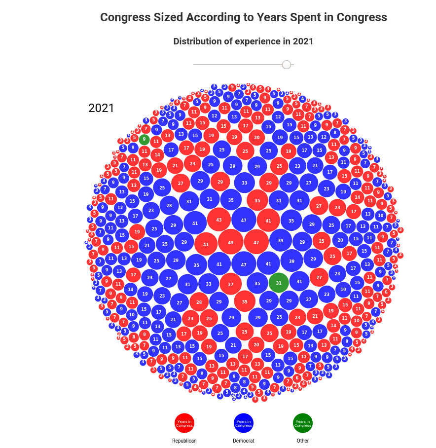
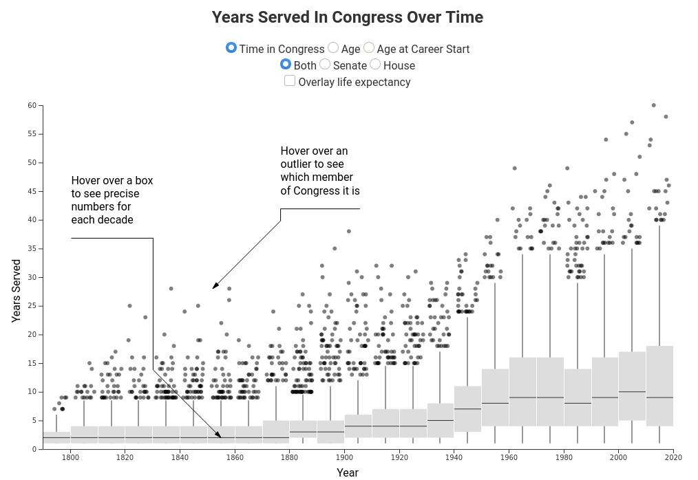
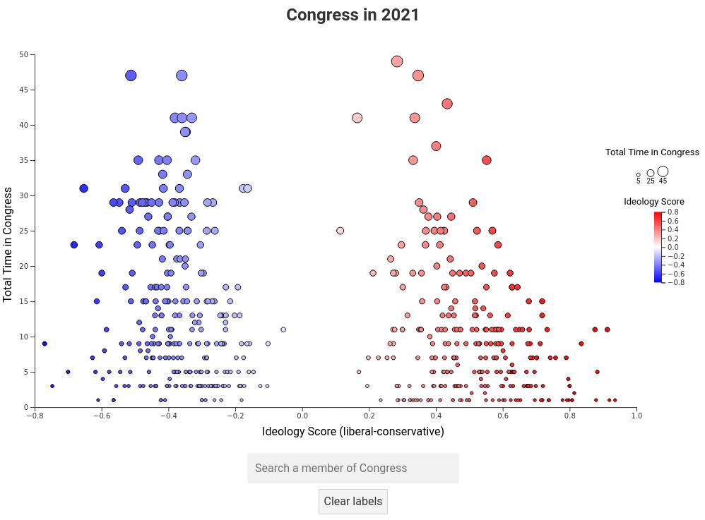

# The Rise of the Career Politician
This project attempts to visualize changes in tenure lengths for members of Congress in the form of a scrolly-telly article.





## Team Members
- Joe Schlessinger

## Links
- [Project Website](https://6859-sp21.github.io/final-project-the-rise-of-the-career-politician/)
- [Project Paper](https://github.com/6859-sp21/final-project-the-rise-of-the-career-politician/writeup.pdf)
- [Project Video](https://drive.google.com/file/d/10ccwIwnkN9Wqwky3uB7_xVQptNgkpVMQ/view?usp=sharing)

## Work Breakdown
I did everything.

## Running Locally
It is pretty easy to run locally. Simply clone the repo and then run the following

```bash
cd cloned-directory
npm install
npm run dev
```
>>>>>>> master
